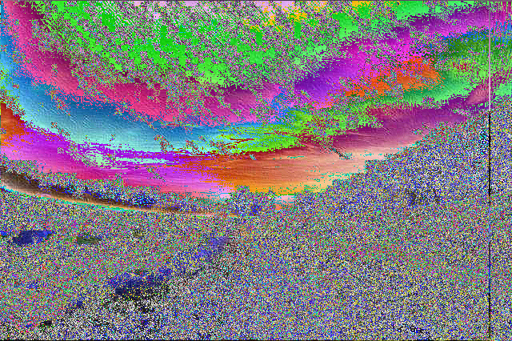

# Laboratorium 4

## Polecenie

Proszę napisać program w języku asemblera w architekturze 32 bit. Program powinien nakładać filtry na obrazy we wskazanym pliku BMP. Proszę zaimplementować co najmniej 3 wybrane filtry.

- podobnie jak poprzednio - algorytm nakładania filtru na piksele musi być napisany w asemblerze, cała reszta (w tym parsowanie BMP) może być w C
- 
- najlepiej wybrać filtry różne (konturowanie, uśrednianie itd)
- 
- w sprawozdaniu dobrze będzie pokazać efekt działania filtrów

## Założenia

1. Do wczytywania i zapisywania plików, tudzież wczytywania parametrów z linii poleceń można (ale nie trzeba) użyć kodu w C. Natomiast główny algorytm steganograficzny musi być zrobiony w asemblerze.

2. Proszę pamiętać, że pliki BMP mają strukturę i metadane (nagłówki), do operowania na plikach BMP można używać kodu w C

Najważniejsza część programu to algorytmy filtrów, które mają być wykonane w assembly

można używać gotowych bibliotek C do operowania na plikach BMP

## Implementacja

Pobranie od użytkownika wraz z uruchomieniem programu parametrów:

- flagę: `-1`,`-2` lub `-3`, wtedy zostanie wykonany jeden z 3 flirtów na podanym pliku `.bmp`
- Nazwę pliku graficznego wejściowego (`.bmp`)
- Nazwę pliku graficznego wyjściowego (`.bmp`)

## Wyniki filtrów
**Oryginał**

**Rozmazanie**

**Sepia**

**Agresywniejsza sepia**

## Błędne ścieżki (Popełnione błędy)

- złe wczytywanie plików assembly

## Wnioski

- C jest łatwiejsze

### Czego się nauczyłem

- Więcej Steganografii
- - Na różnych systemach operacyjnych inaczej kod się wykonuje (to jest bardzo dziwny efekt)

## Literatura

<https://en.wikipedia.org/wiki/Steganography>

<https://en.wikipedia.org/wiki/RGBA_color_model>

<https://www.geeksforgeeks.org/data-type-file-c/>

<https://explainshell.com/>

<https://kcir.pwr.edu.pl/~mucha/PProg/PProg_lab_03/filtrsplot.pdf>

<https://en.wikipedia.org/wiki/Kernel_(image_processing)>

<http://www.algorytm.org/przetwarzanie-obrazow/filtrowanie-obrazow.html>
